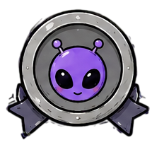
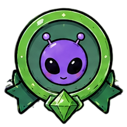
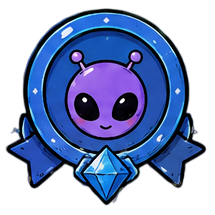
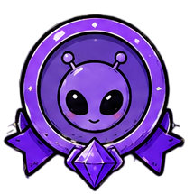
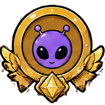
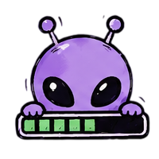
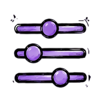
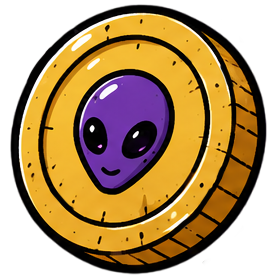
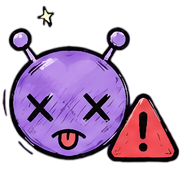
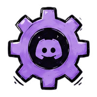

<br>

<p align="center">
  
</p>

<h1 align="center">
  <code>∩lien</code>
</h1>


<p align="center">
  <i>Projeto secreto. Não sabemos de onde veio, só estamos deixando ele crescer.</i>
  <br>
  
</p>

<p align="center">
  
  
  
  
</p>

<p align="center">
  
  
  
  
  
</p>

---

##  O que é o ∩lien?

Um RPG de exploração espacial e economia, jogado inteiramente por comandos `/` no Discord. Você adota um alienígena, monta sua nave, explora planetas, coleta recursos, negocia num mercado com outros jogadores e desbloqueia conquistas — tudo isso rodando em cima de um `data/bot.db` local.

Roda em **dois bots separados no mesmo processo Node** (`index.js` na raiz sobe os dois):

| Bot | Pasta | Função |
|---|---|---|
|  **∩lien** (principal) | raiz do projeto (`commands/`, `events/`, `utils/`) | O jogo em si — exploração, economia, nave, conquistas |
|  **Support Bot** | `support_bot/` | Painel de tickets e regras do servidor de suporte |

Totalmente bilíngue (**pt-BR** / **en-US**) via `utils/i18n.js` + `locales/*.json` — cada jogador escolhe seu idioma com `/config`.

---

##  Loop principal do jogo

<table>
<tr>
<td align="center" width="20%">

<br>
<sub><code>/planet</code></sub><br>
<sub>escolhe a oferta</sub>

</td>
<td align="center">→</td>
<td align="center" width="20%">

<br>
<sub>viagem de ida</sub><br>
<sub>depende do Propulsor</sub>

</td>
<td align="center">→</td>
<td align="center" width="20%">

<br>
<sub>mineração</sub><br>
<sub>depende do Scanner</sub>

</td>
<td align="center">→</td>
<td align="center" width="20%">

<br>
<sub>volta pra Terra</sub><br>
<sub>recursos + ∩oins</sub>

</td>
</tr>
</table>

O jogador acompanha o progresso da missão a qualquer momento — o bot avisa automaticamente no canal quando cada fase termina (`utils/missionNotifier.js`).

---

##  Upgrades de nave (`/craft`)

Cada upgrade tem **5 tiers**, na mesma escala de raridade usada nos planetas — e as tabelas abaixo usam os ícones reais de cada tier dentro do jogo:

###  Propulsor — velocidade de viagem

| Tier | Velocidade |
|---|---|
|  **A** | 2.200 km/s |
|  **B** | 6.000 km/s |
|  **C** | 18.000 km/s |
|  **D** | 30.000 km/s |
|  **E** | 60.000 km/s |

O tempo de viagem (ida e volta) é `distância do planeta ÷ velocidade do propulsor`.

###  Sonda de Escavação — bônus de recursos

| Tier | Bônus |
|---|---|
|  **A** | +0% |
|  **B** | +10% |
|  **C** | +15% |
|  **D** | +25% |
|  **E** | +40% |

Aplicado direto na quantidade de cada recurso sorteado no planeta (`utils/planetResources.js`). O bônus aparece explicitamente na tela do `/planet` e nas mensagens de missão, pra ficar claro que já está incluso.

###  Scanner Estelar — tempo de mineração

| Tier | Tempo de mineração |
|---|---|
|  **A** | 15 min |
|  **B** | 13 min |
|  **C** | 11 min |
|  **D** | 9 min |
|  **E** | 8 min |

Em vez de "alcance" (que não tinha efeito nenhum na versão antiga), o Scanner agora mapeia o subsolo do planeta com mais precisão — reduzindo o tempo real que o alien passa minerando.

---

##  Economia

###  `/daily` — recompensa diária

| | |
|---|---|
|  Base | **1.000 a 2.000 ∩oins** (sorteado) |
|  Sequência | +100 ∩oins por dia seguido, até **+600** no 7º dia |
|  Bônus | +3 recursos aleatórios do universo |
|  Reset | Todo dia à meia-noite (horário de Brasília) |

 Pode ser resgatado em **qualquer servidor** (ou na DM, via instalação de usuário).

###  `/market` — mercado global de recursos

| Regra | Valor |
|---|---|
| Preço mínimo de anúncio | 50% do preço da Loja do Sistema |
| Taxa sobre venda concluída | 5% (paga pelo vendedor) |
| Anúncios ativos por recurso (mesmo jogador) | 1 |

###  `/hatmarket` — mercado de chapéus

| Regra | Valor |
|---|---|
| Preço mínimo de anúncio | 50% do preço base do chapéu |
| Taxa sobre venda concluída | 5% |
| Anúncios ativos por chapéu (mesmo jogador) | 3 |

As taxas de 5% funcionam como **sumidouro de moedas** — ajudam a evitar que a quantidade de ∩oins em circulação só cresça infinitamente.

---

##  Conquistas (`/achievements`)

Mais de 25 conquistas rastreadas automaticamente, cobrindo 13 tipos de estatística (lista única em `gameConfig/achievements.js` → `ACHIEVEMENT_TYPES`):

`planets_seen` - `trips_completed` - `distance_traveled_km` - `resources_collected` - `craft_completed` - `daily_streak` -
`market_global_bought_count` - `market_global_bought_spent` - `market_global_sold_count` - `market_global_sold_revenue` -
`shop_bought_count` - `shop_sold_count` - `bot_invited`

Toda ação relevante (`addMissionCompletionStats`, compra/venda, craft, daily) roda uma checagem e desbloqueia automaticamente — sem precisar de comando manual.

---

##  Ranking (`/ranking`)

Leaderboard Top 10 com 5 categorias, trocáveis por um menu suspenso:

| Categoria | Ícone |
|---|---|
| Mais Ricos |  |
| Planetas Vistos |  |
| Planetas Explorados |  |
| Distância Percorrida |  |
| Recursos Coletados |  |

O painel mostra um **pódio do 1º, 2º e 3º lugar** como destaque e a **posição pessoal de quem usou o comando**, mesmo fora do Top 10.

---

##  Stack técnica

| Peça | Tecnologia |
|---|---|
| Runtime | Node.js 18+ |
| Discord | [discord.js](https://discord.js.org/) v14 (Components V2) |
| Banco de dados | [better-sqlite3](https://github.com/WiseLibs/better-sqlite3), modo **WAL** |
| Avatares/imagens de alien | `@dicebear` + `@resvg/resvg-js` |
| i18n | JSON próprio (`locales/pt-BR.json`, `locales/en-US.json`) via `utils/i18n.js` |

###  Comandos úteis (`package.json`)

```bash
npm start                 # sobe o bot
npm run deploy-commands   # registra/atualiza os slash commands no Discord
npm run generate-planets  # gera as imagens dos planetas
npm run check-config      # valida as variáveis de ambiente/config
```

---

<p align="center">
  
  <br>
  <i>Feito com carinho pra galáxia do Discord.</i>
</p>